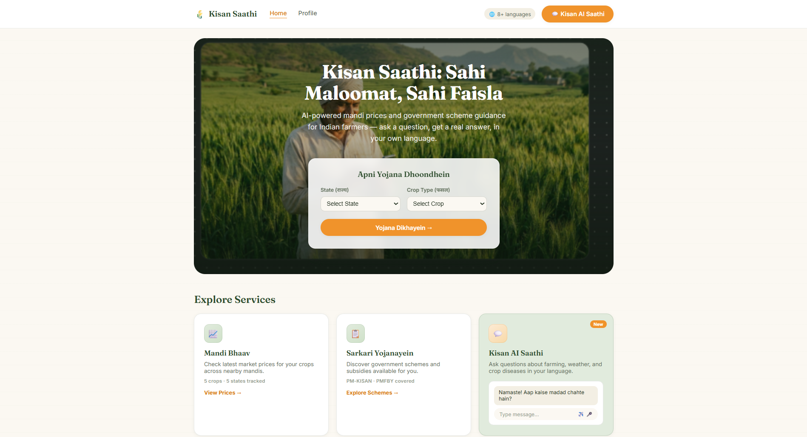
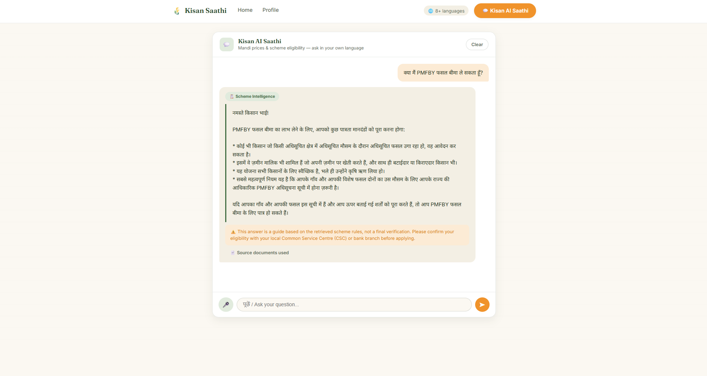
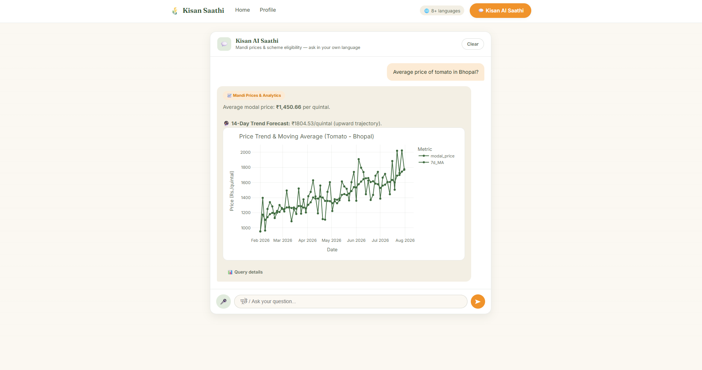
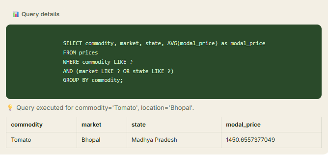

<div align="center">


<a href="https://kisan-saathi-qjjl.onrender.com/">
  
</a>

<br><br>

**[→ Open the live app](https://kisan-saathi-qjjl.onrender.com/)**

</div>

<br>

> *Two things every farmer needs answered fast — "what's my crop worth right now?" and "am I eligible for this scheme?" — answered in 8 Indian languages, with every scheme answer traceable back to the actual government document it came from.*

<br>

<div align="center">

**8** languages&ensp;•&ensp;**2** schemes covered&ensp;•&ensp;**5** states of price data&ensp;•&ensp;**19/19** tests passing

</div>


<br>

## Contents

<table>
<tr>
<td width="33%" valign="top">

**Product**
- [1 · Overview](#1--overview)
- [3 · Features](#3--features)
- [5 · Preview](#5--preview)

</td>
<td width="33%" valign="top">

**Engineering**
- [2 · Project structure](#2--project-structure)
- [4 · API endpoints](#4--api-endpoints)
- [6 · Architecture](#6--architecture-diagram)

</td>
<td width="33%" valign="top">

**Run it**
- [7 · Tech stack](#7--tech-stack)
- [8 · Local deployment](#8--local-deployment)

</td>
</tr>
</table>

<br>

## 1 · Overview

Every question that comes in — typed or spoken — is routed automatically to one of two specialist agents:

<table>
<tr>
<td width="50%" valign="top">

### 📈 Price Agent
Pulls historical mandi price data and returns trends, forecasts, and interactive Plotly charts.

</td>
<td width="50%" valign="top">

### 📋 Scheme Agent — RAG
Retrieves the exact passage from PM-KISAN / PMFBY documents via vector search, then asks Gemini to answer *using that retrieved text* — not its general recollection.

</td>
</tr>
</table>

The routing call itself goes to Gemini first; if that fails, a keyword-based fallback keeps the app answering instead of breaking.

<br>

## 2 · Project structure

<details open>
<summary><b>Show file tree</b></summary>

```
kisan-saathi/
├── app.py                 # FastAPI entrypoint (main API)
├── main.py                # Alternate Streamlit UI
├── router.py               # Intent classification + request routing
├── rag_agent.py            # RAG retrieval + scheme eligibility answers
├── price_agent.py          # Mandi price queries
├── build_index.py          # One-time script: chunks + embeds scheme docs into ChromaDB
├── list_models.py          # Diagnostic: lists Gemini models available to your API key
├── load_prices.py          # Loads mandi price CSV into SQLite
├── data/
│   ├── scheme_docs.txt     # Source documents for RAG (PM-KISAN, PMFBY)
│   └── mandi_prices.csv    # Source data for price agent
├── chroma_db/               # Generated vector store (gitignored)
├── mandi.db                 # Generated SQLite price database
├── web/                     # Frontend (HTML/CSS/JS)
├── tests/
│   ├── test_router.py      # Routing logic tests
│   └── test_rag_agent.py   # Retrieval + generation tests
└── requirements.txt
```

</details>

<br>

## 3 · Features

| | |
|---|---|
| 🔍 **Grounded RAG answers** | Every scheme answer cites the actual retrieved source chunk, shown as an expandable reference. |
| 🌐 **8 Indian languages** | Auto-detected via Unicode script ranges — English, Hindi, Tamil, Telugu, Kannada, Gujarati, Bengali, and Punjabi. |
| 🎙️ **Voice input** | Audio transcribed via Gemini, in addition to text. |
| 🔀 **Hybrid intent routing** | LLM classification with an automatic keyword fallback — a Gemini outage degrades gracefully instead of breaking the app. |
| 📊 **Interactive price charts** | Plotly visualizations for mandi price trends and forecasts. |
| ✅ **Fully tested** | 19 pytest cases covering routing and retrieval, fully mocked — seconds to run, no API key needed. |
| ⚠️ **Honest disclaimers** | Every eligibility answer is flagged as guidance, not final verification, pointing to the nearest CSC or bank branch. |

<br>

## 4 · API endpoints

**`POST /api/ask`**

```json
{ "question": "Am I eligible for PM-KISAN?", "language": "en" }
```
`language` is optional — auto-detected from the question text if omitted. Returns the routed agent, the answer, and (for scheme questions) the retrieved source chunks used to ground it.

**`POST /api/transcribe`**

Accepts an audio file upload, returns transcribed text via Gemini.

<br>

## 5 · Preview

<div align="center">

**Homepage**



<br><br>

**Scheme Agent — grounded RAG answer, in Hindi**



<br><br>

**Price Agent — trend chart + underlying query**




</div>

<br>

## 6 · Architecture diagram

```
                     User question
                          │
                          ▼
          Language detection (Unicode script matching)
                          │
                          ▼
        Intent Router ── LLM classification (Gemini)
              │              └── falls back to ── keyword rules
              │                                          │
              ├────────────────────┬─────────────────────┘
              ▼                    ▼
        Price Agent          Scheme Agent (RAG)
   (SQL query templates            │
    over mandi price data)         ▼
                        1. Embed the question (Gemini embeddings)
                        2. Query ChromaDB for top-3 relevant chunks
                        3. Pass retrieved chunks + question to Gemini
                        4. Return answer + the actual source chunks used
```

Scheme documents are chunked **per-topic**, not by fixed-size splitting, so related content — like a full "who is excluded" list — stays together as one retrievable unit. Chunks are embedded once, offline, via `build_index.py`, and stored in a persistent ChromaDB collection, so each live query only needs to embed the short user question, never the whole document corpus.

<br>

## 7 · Tech stack

<div align="center">

| Layer | Technology |
|:--|:--|
| Backend API | FastAPI |
| Alternate UI | Streamlit |
| LLM / generation | Google Gemini `gemini-2.5-flash` |
| Embeddings | Google Gemini `gemini-embedding-001` |
| Vector store | ChromaDB |
| Price data | SQLite + pandas |
| Charts | Plotly |
| Testing | pytest + unittest.mock |
| Deployment | Render |

</div>

<br>

## 8 · Local deployment

```bash
# clone and install
git clone https://github.com/Savree97/kisan-saathi.git
cd kisan-saathi
python -m venv .venv
source .venv/bin/activate     # macOS/Linux
.venv\Scripts\activate        # Windows
pip install -r requirements.txt

# set up your API key
echo "GOOGLE_API_KEY=your_gemini_api_key_here" > .env
# get a key at https://aistudio.google.com/apikey

# build the vector index (rerun whenever scheme_docs.txt changes)
python build_index.py

# load price data
python load_prices.py

# run the app
uvicorn app:app --reload
# or, the Streamlit UI:
streamlit run main.py
```

Run tests:
```bash
pip install pytest
python -m pytest tests/ -v
```

<br>


<div align="center">

*Kisan Saathi is a demo/portfolio project, not an official government service. Eligibility answers are general guidance based on retrieved scheme text — always confirm details with your local Common Service Centre (CSC) or bank branch before applying.*

**[Live demo](https://kisan-saathi-qjjl.onrender.com/)** · **[Report an issue](https://github.com/Savree97/kisan-saathi/issues)**

</div>